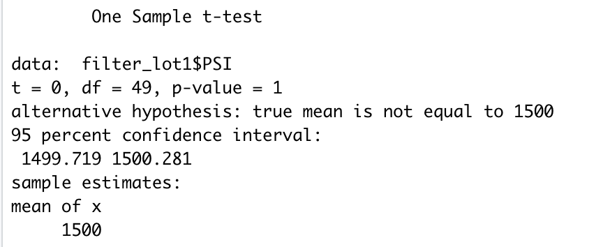
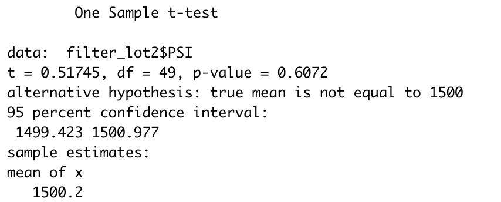
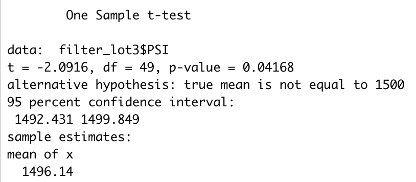

# MechaCar_Statistical_Analysis

## Linear Regression to Predict MPG

The goal of this analysis was to determine which variables had the greatest impact on a car's fuel efficiency. The results how that both ground clearance and vehicle length have the highest correlative effect on fuel economy.

The slope of this model is not zero, as we are able to fit a trend line to the data with some of the identified variables, indicating a causal relationship.

This model overall has a good level of predictive power, as indicated by the R-squared values of around 70%.

## Summary Statistics on Suspension Coils

The design specifications for the MechaCar suspension coils dictate that the variance of the suspension coils must not exceed 100 pounds per square inch. Overall, we're seeing an average variance of 62 pounds per square inch, which is within the required tolerance.

However, when diving deeper to view each lot individually, we can see that Lot 3 has variances of 170 pounds per square inch, which is signficantly outside of the required guidance.

## T-Tests on Suspension Coils

The analysis then proceded to perform a one-sample t-test on suspension coil data. We were able to determine that the true mean of the data lies within a window between 1497.5 and 1500, with a confidence of .06.

Diving deeper and viewing each lot individually, we can see that Lot 1 has an average mean PSI of 1500 with 100% confidence, Lot 2 also likely has a mean PSI of 1500, and Lot 3 has the highest variability in its mean PSI

## Study Design: MechaCar vs Competition

When thinking about designing a study to evaluate MechaCar compared to other vehicles on the market, it is important to focus on factors that matter to consumers. These include performance metrics like MPG and horsepower, as well as crash-safety and overall reliability. For example:

- MPG, city and highway
- Horsepower
- Crash-safety ratings from NHTSA
- Reliablity (aka, how many "maintenance incidents" does the vehicle have over its lifetime, measured by appointments at service centers)

All of this data should be available internally from MechaCar, as well as from public-faching databases at government organizations like the NHTSA and EPA.
